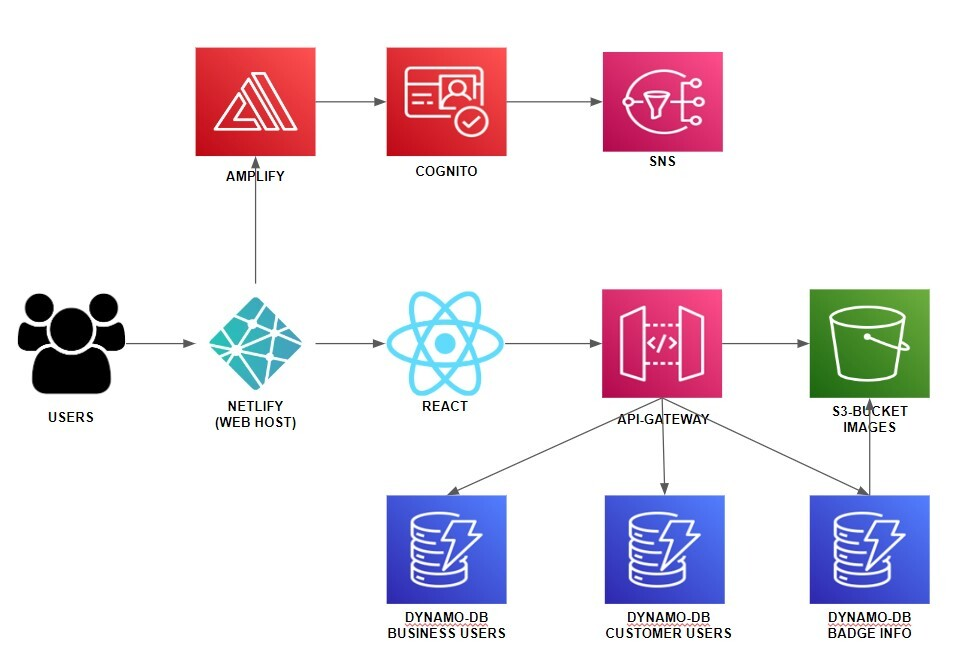

# Elite Managing

Developed by: [Yaakov Stein](https://www.linkedin.com/in/yaakov-s-79a598ab/), [Yosef Teitelbaum](https://www.linkedin.com/in/joseph-teitelbaum-b60366231/), [David Kohanchi](https://www.linkedin.com/in/david-kohanchi/), and [Sam Shulman](https://www.linkedin.com/in/sam-shulman/)

Mentor: [Alex Porcelain](https://www.linkedin.com/in/alexporcelain/)

We are a team of undergraduate students at Yeshiva University studying Computer Science. We developed this customer relationship management application during Summer 2022.

Due to the Covid-19 pandemic, the customer relationships that were so critical to the success of so many small businesses were decimated. This application allows businesses to rebuild that connection and customer loyalty while enjoying a seamless user experience.

This app is written in React and uses Amplify, Amazon Cognito, Amazon DynamoDB, Amazon S3 and API Gateway.

## Architecture Diagram

## Netlify 

We took advantage of the Netlify deployment platform to deploy this application.

## React

We used React to build all the front-end components and to implement routing for the app.

## API Gateway
Yaakov write here 

## S3 Buckets
Yaakov write here

## DynamoDB
Yaakov write here

## Cognito
We used two separate Cognito user pools. One for the business owner and one for the customer. The business owner user pool is used to manage access so only the business owner can view customer information. The customer user pool is used to manage the customer account.

## Amplify
We used Amplify and Amplify Studio to create and continuously run a backend for our application. Amplify stores the backend environment in an instance of an S3 bucket (described above). Amplify is also configured to allow for the google maps rendering within each business card. 

## Instillation
Yosef write here

